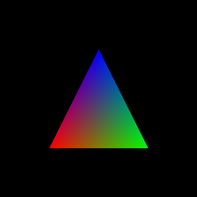

## HRender
A software render to imitate OpenGL. To learn the pipeline, CG algorithm and know the internal mechanism of OpenGL.
## Use
```
xmake
xmake run
```
## Feature
1. uniform triangle


2. Interpolation

