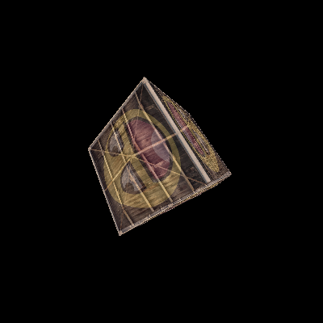

## HRender
A software render.
## Use
```
xmake
xmake run
```

## Feature
* 重心坐标插值，Breseham画线
* 纹理采样：双线性插值过滤和最近邻过滤
* 矩阵变换：平移，旋转，缩放
* 深度测试
* 正交投影，透视投影，透视除法
* 摄像机

## todo
* 窗口
* MSAA
* mipmap
* swapchain,framebuffer
* trimesh load
* multiple thread
## Result


